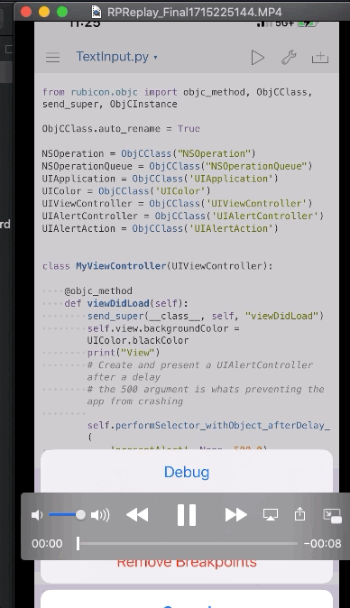

# Python_objective-C
iOS apps made with Python

## Introduction
This repository contains a collection of iOS apps made with Python. The apps are made with the [Pythonista](http://omz-software.com/pythonista/) app for iOS, which allows you to run Python scripts on your iPhone or iPad.

Libraries are Rubicon-ObjC and objc_util, which can be installed in Pythonista with some modifications.

## Apps
- [**Battery App**](Battery%20App) - A Battery app that shows the current charging status for your iPhone.

- [**Text App**](Text%20App) - A simple text app that will alert you on the screen.

